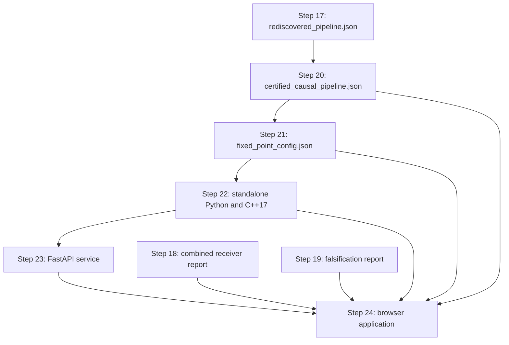

# GENESIS-DSP

<p align="center">
  <strong>An end-to-end research framework for impairment-aware IQ signal generation, autonomous DSP pipeline discovery, falsification, deployment verification, fixed-point conversion, code export, and web/API execution.</strong>
</p>

<p align="center">
  
  
  
  
  
  
</p>

---

## Table of Contents

- [Overview](#overview)
- [Scope and Intended Use](#scope-and-intended-use)
- [Core Capabilities](#core-capabilities)
- [System Architecture](#system-architecture)
- [Signal and Impairment Model](#signal-and-impairment-model)
- [DSP Pipeline Discovery](#dsp-pipeline-discovery)
- [Current Certified Runtime Pipeline](#current-certified-runtime-pipeline)
- [Validation and Experimental Results](#validation-and-experimental-results)
- [24-Step Development Pipeline](#24-step-development-pipeline)
- [Repository Structure](#repository-structure)
- [Installation](#installation)
- [Reproducing the Full Experiment](#reproducing-the-full-experiment)
- [Launching the Web Application](#launching-the-web-application)
- [Using the Web Interface](#using-the-web-interface)
- [IQ CSV Input Contract](#iq-csv-input-contract)
- [REST API](#rest-api)
- [Generated Artifacts](#generated-artifacts)
- [Fixed-Point Design](#fixed-point-design)
- [Code Export](#code-export)
- [Performance Notes](#performance-notes)
- [Reproducibility](#reproducibility)
- [Known Limitations](#known-limitations)
- [Roadmap](#roadmap)
- [Security Notes](#security-notes)
- [Contributing](#contributing)
- [Citation](#citation)
- [License](#license)

---

## Overview

**GENESIS-DSP** is a modular digital signal processing research platform designed to study the complete lifecycle of a communication receiver algorithm:

1. generate a known complex-baseband waveform,
2. inject controlled RF/baseband impairments,
3. measure signal quality,
4. construct DSP blocks through a common interface,
5. search block parameters and pipeline topology,
6. compare discovered pipelines against classical baselines,
7. falsify the selected solution under stress conditions,
8. verify causality, BIBO stability, determinism, graph validity, and parameter constraints,
9. convert the certified pipeline to fixed-point arithmetic,
10. export standalone Python and C++17 implementations,
11. expose the runtime through FastAPI,
12. execute and visualize IQ processing from a browser.

The repository is intentionally organized as a **progressive 24-step engineering workflow**. Each step adds one independently testable capability and writes machine-readable artifacts into the `outputs/` directory for the next step.

> **Important:** GENESIS-DSP is a research and prototyping framework, not a production modem. The full experimental receiver and the lightweight web runtime are related but not identical. The current web application executes a certified three-block front-end correction pipeline, while the more complete receiver experiments in Step 18 also evaluate timing selection and widely-linear equalization.

---

## Scope and Intended Use

GENESIS-DSP is intended for:

- complex-baseband IQ experimentation,
- SDR receiver prototyping,
- communication impairment simulation,
- DSP algorithm comparison,
- automatic parameter and topology search,
- fixed-point feasibility analysis,
- pre-FPGA and pre-embedded validation,
- receiver robustness and counterexample research,
- educational demonstrations of QPSK correction,
- API-based DSP integration and visualization.

Typical users include students, communication engineers, SDR developers, embedded-DSP engineers, and researchers working on receiver synchronization, equalization, fixed-point implementation, or automated algorithm discovery.

---

## Core Capabilities

| Area | Implemented capability |
|---|---|
| Waveform generation | Reproducible QPSK source and pulse-shaped signal records |
| Channel simulation | AWGN, CFO, phase offset, timing offset, multipath, IQ imbalance, DC offset, clipping |
| Metrics | BER, EVM, NMSE, estimated SNR and related diagnostic values |
| Classical receiver | CFO estimation/correction, timing selection, equalization and symbol decisions |
| DSP abstraction | Validated block interface, parameter specifications, execution records |
| Registry | Named block construction and parameterized instantiation |
| Graph execution | Directed acyclic pipeline graph, topological execution, cycle and parent validation |
| Serialization | JSON pipeline packages, schema validation, hashing and tamper detection |
| Optimization | Continuous parameter optimization and coordinate refinement |
| Topology search | Exhaustive small-topology search and complexity-aware scoring |
| Evolutionary discovery | Population-based topology evolution |
| Multi-objective search | Pareto analysis over signal error, operation cost and block count |
| Rediscovery | Controlled recovery of a hidden correction chain |
| Falsification | Stress scenarios, acceptance thresholds and worst-counterexample export |
| Formal deployment checks | Prefix causality, BIBO bounds, deterministic replay, finite-value checks |
| Fixed-point | Word-length search, saturation emulation, NCO phase quantization |
| Export | Standalone Python, C++17, CMake and SHA-256 manifest generation |
| Backend | FastAPI endpoints with Pydantic validation and OpenAPI schema |
| Web application | CSV IQ input, float/fixed execution, constellation/time plots and benchmarks |

---

## System Architecture

```mermaid
flowchart LR
    A[QPSK Source] --> B[Pulse Shaping / Signal Record]
    B --> C[Impairment Pipeline]
    C --> D[Metrics Engine]
    D --> E[Classical Baseline]

    C --> F[DSP Block Registry]
    F --> G[Pipeline Graph]
    G --> H[Continuous Optimization]
    H --> I[Topology Search]
    I --> J[Evolutionary Search]
    J --> K[Pareto Selection]
    K --> L[Algorithm Rediscovery]

    L --> M[Combined Receiver]
    M --> N[Falsification Engine]
    N --> O[Causality / Stability Certification]
    O --> P[Fixed-Point Conversion]
    P --> Q[Python / C++ Export]
    Q --> R[FastAPI Backend]
    R --> S[Web Dashboard]
```



### Artifact flow



---

## Signal and Impairment Model

### QPSK symbols

The reference constellation uses unit-average-power QPSK symbols:

$$
a_k = \frac{b_{I,k} + j b_{Q,k}}{\sqrt{2}},
\qquad b_{I,k},b_{Q,k}\in\{-1,+1\}.
$$

After interpolation and pulse shaping, the discrete-time complex-baseband waveform is represented by \(s[n]\).

### Composite received-signal model

The experiments model a received sequence using a combination of multipath, timing displacement, carrier offset, phase offset, IQ imbalance, DC offset, noise, and optional nonlinear clipping. A compact representation is:

$$
u[n] = e^{j\left(2\pi \Delta f n/F_s + \phi_0\right)}
\sum_{\ell=0}^{L-1} h[\ell]\,s[n-\tau-\ell],
$$

$$
r[n] = \mathcal{C}\left(\mu u[n] + \nu u^*[n] + d\right) + w[n],
$$

where:

- \(F_s\) is the sample rate,
- \(\Delta f\) is the carrier-frequency offset,
- \(\phi_0\) is the initial carrier phase,
- \(h[\ell]\) is the multipath channel,
- \(	au\) is the timing displacement,
- \(\mu\) and \(
u\) form the widely-linear IQ-imbalance model,
- \(d\) is complex DC offset,
- \(w[n]\) is complex AWGN,
- \(\mathcal{C}(\cdot)\) is the clipping/nonlinearity operator.

### Primary metrics

Normalized mean-square error:

$$
\mathrm{NMSE} =
\frac{\sum_n |\hat{x}[n]-x[n]|^2}
{\sum_n |x[n]|^2}.
$$

RMS error-vector magnitude:

$$
\mathrm{EVM}_{\mathrm{RMS}} =
100\sqrt{
\frac{\sum_k |\hat{a}_k-a_k|^2}
{\sum_k |a_k|^2}
}\ \%.
$$

Bit-error rate:

$$
\mathrm{BER} = \frac{N_{\mathrm{bit\ errors}}}{N_{\mathrm{total\ bits}}}.
$$

Metrics are computed on explicitly separated training, validation, and test regions where applicable.

---

## DSP Pipeline Discovery

GENESIS-DSP separates **block behavior**, **graph structure**, **parameter optimization**, and **deployment verification**.

### Block layer

Each block implements a common contract with:

- a stable `block_id`,
- a human-readable name and category,
- typed parameter specifications,
- parameter-bound validation,
- a `process(SignalFrame)` operation,
- metadata-preserving output construction,
- estimated operation/MAC cost.

The default registry contains correction blocks such as:

- `complex_gain`,
- `dc_removal`,
- `frequency_shift`.

Step 20 adds the deployable:

- `causal_dc_blocker`.

### Graph layer

`PipelineGraph` represents the receiver as a directed acyclic graph. It performs:

- node and edge validation,
- topological ordering,
- source/leaf detection,
- cycle rejection,
- unsupported multi-parent rejection,
- deterministic graph execution,
- configuration export/import.

### Search layer

The discovery workflow includes:

1. **Continuous optimization** of block parameters.
2. **Discrete topology enumeration** over short block sequences.
3. **Evolutionary search** over pipeline populations.
4. **Pareto optimization** across signal error and implementation cost.
5. **Rediscovery experiments** that verify whether the framework can recover a hidden correction chain.

Search objectives combine signal-domain error with structural or computational penalties. Exact constants, candidate sets, mutation rules, and stopping criteria are defined in the corresponding step scripts so every experiment remains inspectable and reproducible.

### Discovery lifecycle


---

## Current Certified Runtime Pipeline

The browser/API runtime currently executes the following pipeline:

```text
complex_gain
    -> causal_dc_blocker
    -> frequency_shift
```

### 1. Complex gain correction

$$
y[n] = g\,x[n], \qquad g = g_R + jg_I.
$$

This stage jointly corrects amplitude and static phase rotation.

### 2. Causal DC blocker

The original full-frame mean subtraction was intentionally identified as non-causal for streaming use. It was replaced by a first-order causal DC blocker:

$$
y[n] = x[n] - x[n-1] + r\,y[n-1],
$$

with transfer function:

$$
H(z) = \frac{1-z^{-1}}{1-rz^{-1}},
\qquad 0 \le r < 1.
$$

The certified configuration uses `pole_radius = 0.995`. For this range the filter is causal and BIBO-stable. The implemented theoretical \(\ell_\infty\) gain bound for the DC blocker is 2.

### 3. Frequency-shift correction

$$
y[n] = x[n] e^{j\left(2\pi f_c n/F_s + \phi_c\right)}.
$$

The fixed-point implementation uses a quantized phase accumulator and quantized complex oscillator.

> The runtime coefficients are artifacts of the reference discovery experiment. The web application does not currently re-estimate all coefficients from every uploaded file.

---

## Validation and Experimental Results

The following values were produced during the reference development run. They document one reproducible experiment; they are not universal performance guarantees for arbitrary channels or hardware.

### Algorithm rediscovery — Step 17

| Quantity | Result |
|---|---:|
| Evaluated topologies | 15 |
| Rediscovered topology | `complex_gain -> dc_removal -> frequency_shift` |
| True CFO | 18,750 Hz |
| Discovered correction | -18,749.525760 Hz |
| CFO residual error | +0.474240 Hz |
| Complex-gain error | \(1.694357\times10^{-3}\) |
| NMSE | \(1.585295842827\times10^{-4}\) |
| EVM | 1.259085% |
| Improvement over incomplete topology | 374.879× |

### Combined receiver — Step 18

| Quantity | Result |
|---|---:|
| True CFO | 7,500 Hz |
| Estimated CFO | 7,499.515413 Hz |
| CFO error | -0.484587 Hz |
| Selected timing index | 49 |
| Equalizer family | Widely linear |
| Equalizer length | 13 |
| Ridge regularization | \(10^{-6}\) |
| Evaluated receiver models | 90 |
| Raw BER | 0.495592556 |
| Validation BER | 0 |
| Test BER | 0 |
| Test errors | 0 / 4,568 |
| Test EVM | 19.403369% |
| Reproducibility error | 0 |

A zero hard-decision BER can coexist with a non-zero EVM when samples remain inside the correct QPSK decision regions.

### Falsification — Step 19

| Quantity | Result |
|---|---:|
| Stress scenarios | 43 |
| Acceptance failures | 42 |
| Failure rate | 97.674% |
| Nominal BER | 0 |
| Worst-case BER | 0.516418564 |
| Worst-case errors | 2,359 / 4,568 |
| Worst-case EVM | 152.868857% |
| Worst-case CFO error | +61,312.828291 Hz |

**Interpretation:** `42 failures` does **not** mean that 42 software unit tests are broken. Step 19 deliberately searches for out-of-distribution or severe impairment combinations that violate strict receiver acceptance thresholds. The result demonstrates that the fixed receiver is successful in the nominal experiment but is not yet an adaptive, universally robust modem.

### Causality and stability certification — Step 20

| Quantity | Result |
|---|---:|
| Certification tests | 12 / 12 passed |
| Legacy graph prefix-causality error | \(9.137128\times10^{-1}\) |
| Certified graph prefix-causality error | 0 |
| Measured maximum BIBO gain | 1.266956128 |
| Theoretical BIBO gain bound | 2.484204557 |
| Determinism error | 0 |
| Certificate status | `CERTIFIED` |

Certification is relative to the implemented mathematical and numerical test suite; it is not a regulatory or safety certification.

### Fixed-point conversion — Step 21

| Quantity | Result |
|---|---:|
| Evaluated formats | 12 |
| Passing formats | 2 |
| Selected sample/coefficient format | Signed 16-bit Q3.13 |
| Integer / fractional bits | 3 / 13 |
| NCO phase accumulator | 24 bits |
| Quantization step | \(1.220703125\times10^{-4}\) |
| Float-reference NMSE | \(2.590852027063\times10^{-7}\) |
| Float-reference EVM | 0.050900413% |
| Maximum absolute error | \(1.146080253317\times10^{-3}\) |
| Saturation count | 0 |
| Determinism error | 0 |

### Export, API and web verification — Steps 22–24

| Layer | Verification result |
|---|---|
| Standalone Python float export | Maximum error 0 |
| Standalone Python fixed export | Maximum error 0, bit-exact |
| Python replay determinism | Error 0 |
| C++17 source generation | Completed |
| C++17 compile test | Skipped when no `g++`/`clang++` is installed |
| FastAPI self-test | 512 samples, float/fixed error 0 |
| OpenAPI generation | Passed |
| Web float benchmark self-test | Passed |
| Web fixed benchmark self-test | Passed |

---

## 24-Step Development Pipeline

| Step | File | Responsibility |
|---:|---|---|
| 01 | `01_qpsk_generator.py` | QPSK symbols, pulse shaping and deterministic source generation |
| 02 | `02_signal_record.py` | Typed signal records, metadata and dataset organization |
| 03 | `03_basic_impairments.py` | AWGN, CFO and phase impairment primitives |
| 04 | `04_multipath_timing.py` | Multipath channel and timing displacement |
| 05 | `05_iq_dc_clipping.py` | IQ imbalance, DC offset and clipping |
| 06 | `06_impairment_pipeline.py` | Ordered composite impairment execution |
| 07 | `07_metrics_engine.py` | BER, EVM, NMSE and signal-quality metrics |
| 08 | `08_classical_baseline.py` | Classical QPSK receiver baseline |
| 09 | `step09_dsp_block_interface.py` | Common DSP block contract and execution records |
| 10 | `step10_block_registry.py` | Block registration and parameterized construction |
| 11 | `step11_pipeline_graph.py` | DAG representation, validation and execution |
| 12 | `step12_pipeline_serialization.py` | JSON package schema, hashing and tamper detection |
| 13 | `step13_continuous_optimizer.py` | Continuous parameter optimization |
| 14 | `step14_topology_search.py` | Exhaustive short-topology search |
| 15 | `step15_evolutionary_discovery.py` | Evolutionary pipeline discovery |
| 16 | `step16_pareto_optimizer.py` | Multi-objective Pareto selection |
| 17 | `step17_algorithm_rediscovery.py` | Hidden-algorithm rediscovery experiment |
| 18 | `step18_combined_recovery.py` | Joint CFO, timing and equalizer model evaluation |
| 19 | `step19_falsification_engine.py` | Stress testing and counterexample discovery |
| 20 | `step20_stability_causality_constraints.py` | Causality, BIBO, determinism and graph certification |
| 21 | `step21_fixed_point_conversion.py` | Word-length search and fixed-point equivalence |
| 22 | `step22_code_export.py` | Standalone Python/C++17/CMake export |
| 23 | `step23_api_backend.py` | FastAPI processing service and OpenAPI schema |
| 24 | `step24_web_application.py` | Web dashboard, visualization and benchmarking |

---

## Repository Structure

```text
GENESIS-DSP/
├── 01_qpsk_generator.py
├── 02_signal_record.py
├── 03_basic_impairments.py
├── 04_multipath_timing.py
├── 05_iq_dc_clipping.py
├── 06_impairment_pipeline.py
├── 07_metrics_engine.py
├── 08_classical_baseline.py
├── step09_dsp_block_interface.py
├── step10_block_registry.py
├── step11_pipeline_graph.py
├── step12_pipeline_serialization.py
├── step13_continuous_optimizer.py
├── step14_topology_search.py
├── step15_evolutionary_discovery.py
├── step16_pareto_optimizer.py
├── step17_algorithm_rediscovery.py
├── step18_combined_recovery.py
├── step19_falsification_engine.py
├── step20_stability_causality_constraints.py
├── step21_fixed_point_conversion.py
├── step22_code_export.py
├── step23_api_backend.py
├── step24_web_application.py
├── outputs/                         # Generated at runtime
│   ├── step01/
│   ├── ...
│   └── step24/
└── README.md
```

The `outputs/` tree is the experiment database. Later stages consume JSON, CSV, NPZ, PNG, Python, C++ and manifest artifacts generated by earlier stages.

---

## Installation

### Requirements

- Python 3.11 or newer recommended
- NumPy
- Matplotlib
- FastAPI
- Uvicorn
- Pydantic
- Optional: `g++` or `clang++` for C++ verification
- Optional: PyInstaller for Windows packaging

### Clone

```bash
git clone https://github.com/csondurr/GENESIS-DSP.git
cd GENESIS-DSP
```

### Create a virtual environment

#### Windows PowerShell

```powershell
python -m venv .venv
.\.venv\Scripts\Activate.ps1
python -m pip install --upgrade pip
python -m pip install numpy matplotlib fastapi uvicorn pydantic
```

#### Linux/macOS

```bash
python3 -m venv .venv
source .venv/bin/activate
python -m pip install --upgrade pip
python -m pip install numpy matplotlib fastapi uvicorn pydantic
```

Optional tools:

```bash
python -m pip install pyinstaller
```

---

## Reproducing the Full Experiment

The steps are intentionally sequential. Run them from the repository root in the following order:

```bash
python 01_qpsk_generator.py
python 02_signal_record.py
python 03_basic_impairments.py
python 04_multipath_timing.py
python 05_iq_dc_clipping.py
python 06_impairment_pipeline.py
python 07_metrics_engine.py
python 08_classical_baseline.py
python step09_dsp_block_interface.py
python step10_block_registry.py
python step11_pipeline_graph.py
python step12_pipeline_serialization.py
python step13_continuous_optimizer.py
python step14_topology_search.py
python step15_evolutionary_discovery.py
python step16_pareto_optimizer.py
python step17_algorithm_rediscovery.py
python step18_combined_recovery.py
python step19_falsification_engine.py
python step20_stability_causality_constraints.py
python step21_fixed_point_conversion.py
python step22_code_export.py
python step23_api_backend.py
python step24_web_application.py
```

Each successful step prints a completion summary and writes its own artifacts under `outputs/stepXX/`.

If a later script reports that an input artifact is missing, run the referenced earlier step first. For example, Step 22 requires the certified Step 20 pipeline and the Step 21 fixed-point configuration.

---

## Launching the Web Application

First run the Step 24 self-test and generate the site assets:

```bash
python step24_web_application.py
```

Start the server:

```bash
python step24_web_application.py --serve --open-browser
```

Default URLs:

- Web dashboard: `http://127.0.0.1:8080`
- Mounted DSP API: `http://127.0.0.1:8080/api`
- Swagger UI: `http://127.0.0.1:8080/api/docs`
- Web application OpenAPI: `http://127.0.0.1:8080/docs`

The terminal must remain open while the server is running.

---

## Using the Web Interface

### 1. Select the arithmetic mode

- **Floating-point:** high-precision NumPy reference implementation.
- **Fixed-point Q3.13:** numerical emulation of the selected 16-bit deployment format.

### 2. Enter the sample rate

The value must match the real sample rate of the uploaded IQ sequence. Frequency correction is computed from normalized discrete-time phase, so an incorrect sample rate produces an incorrect frequency shift.

### 3. Load or generate IQ samples

- Use **Generate Demo QPSK** for a built-in impaired test signal.
- Use **CSV upload** for external SDR or simulation data.

### 4. Execute the pipeline

The browser sends IQ samples to the FastAPI backend. The backend executes the selected standalone pipeline and returns:

- corrected IQ samples,
- sample count,
- input average power,
- output average power,
- output peak magnitude.

### 5. Interpret the plots

- **Purple:** input IQ data.
- **Cyan:** processed output.
- **Constellation view:** complex-plane sample distribution.
- **Amplitude time series:** \( |x[n]| \) versus sample index.

For a QPSK signal with carrier rotation, a circular/ring-like input distribution can collapse toward four clusters after successful CFO and phase/gain correction.

### 6. Run the benchmark

The benchmark measures median processing latency and throughput in samples/s or MS/s. Results are specific to the CPU, Python version, operating system and selected sample count.

---

## IQ CSV Input Contract

The current Step 24 browser parser expects one complex IQ sample per row.

Recommended format:

```csv
real,imag
0.125000,-0.320000
0.240000,-0.115000
-0.410000,0.280000
```

Headerless input is also accepted:

```csv
0.125000,-0.320000
0.240000,-0.115000
-0.410000,0.280000
```

The current parser:

- accepts comma, semicolon or tab delimiters,
- ignores non-numeric header rows,
- interprets the first two numeric columns as `I` and `Q`,
- ignores additional columns,
- skips rows that do not contain two finite numeric values.

Therefore:

```csv
time,label,real,imag
0.000001,1,0.125,-0.320
```

is **not safe** in the current Step 24 importer because `time` and `label` would be interpreted as I/Q. Reorder the columns before upload:

```csv
real,imag,time,label
0.125,-0.320,0.000001,1
```

Automatic schema detection and explicit I/Q column selection are planned improvements.

---

## REST API

Step 23 exposes the DSP runtime through FastAPI. Step 24 mounts this application under `/api`.

### Endpoints

| Method | Standalone Step 23 | Mounted Step 24 | Purpose |
|---|---|---|---|
| GET | `/health` | `/api/health` | Service and export hash status |
| GET | `/pipeline` | `/api/pipeline` | Runtime nodes and fixed-point format |
| POST | `/process/float` | `/api/process/float` | Floating-point IQ processing |
| POST | `/process/fixed` | `/api/process/fixed` | Fixed-point IQ processing |

### Request schema

```json
{
  "sample_rate_hz": 1000000.0,
  "samples": [
    {"real": 0.125, "imag": -0.320},
    {"real": 0.240, "imag": -0.115}
  ]
}
```

### Response schema

```json
{
  "mode": "fixed",
  "sample_rate_hz": 1000000.0,
  "samples": [
    {"real": 0.0, "imag": 0.0}
  ],
  "metrics": {
    "sample_count": 2,
    "input_average_power": 0.0,
    "output_average_power": 0.0,
    "output_peak_magnitude": 0.0
  }
}
```

The numeric values above illustrate the schema only.

### Python client example

```python
import requests

payload = {
    "sample_rate_hz": 1_000_000.0,
    "samples": [
        {"real": 0.125, "imag": -0.320},
        {"real": 0.240, "imag": -0.115},
    ],
}

response = requests.post(
    "http://127.0.0.1:8080/api/process/fixed",
    json=payload,
    timeout=30,
)
response.raise_for_status()
print(response.json())
```

The API limits each processing request to 200,000 samples. The web benchmark supports up to 1,000,000 generated samples and 15 repetitions.

---

## Generated Artifacts

Important outputs include:

| Step | Artifact | Purpose |
|---:|---|---|
| 12 | `pipeline_package.json` | Serialized graph package and hash checks |
| 13 | `optimized_pipeline_package.json` | Continuous-parameter optimum |
| 14 | topology-search reports | Ranked discrete pipelines |
| 15 | evolutionary-search reports | Generation history and best individual |
| 16 | Pareto reports/plots | Multi-objective frontier |
| 17 | `rediscovered_pipeline.json` | Rediscovered correction chain |
| 18 | `combined_recovery_report.json` | CFO/timing/equalizer metrics |
| 19 | `falsification_report.json` | Failure statistics and worst scenario |
| 20 | `certified_causal_pipeline.json` | Deployment-compatible pipeline |
| 20 | `constraint_certificate.json` | Causality/stability certificate data |
| 20 | `constraint_test_matrix.csv` | Individual certification records |
| 21 | `fixed_point_config.json` | Selected word lengths and arithmetic policy |
| 21 | `fixed_point_signals.npz` | Float/fixed equivalence vectors |
| 22 | `genesis_dsp_export.py` | Standalone Python runtime |
| 22 | `genesis_dsp_export.hpp/.cpp` | C++17 runtime |
| 22 | `export_manifest.json` | SHA-256 file manifest |
| 23 | `openapi_schema.json` | API contract |
| 24 | `site/` | Generated HTML/CSS/JavaScript application |
| 24 | `GENESIS_DSP_WEB_PACKAGE.zip` | Web-asset distribution package |

---

## Fixed-Point Design

The selected arithmetic configuration is:

- signed two's-complement numerical model,
- 16 total bits,
- 3 integer bits including sign,
- 13 fractional bits,
- round-to-nearest quantization,
- saturation on overflow,
- 24-bit NCO phase accumulator.

The representable component range is approximately:

$$
-4 \le x \le 4 - 2^{-13}.
$$

Quantization is applied to:

- input I and Q components,
- complex-gain coefficients,
- DC-blocker pole,
- recursive filter states/outputs,
- NCO oscillator samples,
- block outputs.

The Python fixed-point mode is an **arithmetic emulator**, not an optimized hardware implementation. Its purpose is numerical equivalence and word-length analysis.

---

## Code Export

Step 22 creates:

- standalone NumPy float processing,
- standalone NumPy fixed-point processing,
- a C++17 header,
- a C++17 implementation,
- a CMake project,
- input and expected-output CSV test vectors,
- SHA-256 manifest data.

Python verification uses:

- float maximum-error tolerance: \(10^{-12}\),
- fixed-point tolerance: exact equality,
- deterministic replay: exact equality.

When `g++` or `clang++` is available, Step 22 compiles and executes the C++ program against the exported fixed-point reference vector. Without a compiler, source generation succeeds but compile verification is reported as `SKIPPED_NO_COMPILER`.

---

## Performance Notes

The float path is vectorized with NumPy where possible. The fixed-point Python emulator performs repeated quantization and includes sample-by-sample recursive processing, so it can be significantly slower than float mode.

This does **not** imply that fixed-point hardware is inherently slower. The intended deployment targets—optimized C++, SIMD, DSP processors, FPGA pipelines or HDL—can exploit integer arithmetic and parallelism that the Python reference emulator does not.

Benchmark results should always be reported together with:

- CPU model,
- Python version,
- NumPy version,
- operating system,
- sample count,
- repetition count,
- processing mode.

---

## Reproducibility

The scripts use explicit random seeds for deterministic experiments. Examples include the search, falsification and certification stages. Generated reports also record important configuration values, objective histories and selected models.

For strict reproducibility:

1. use the same Python and NumPy versions,
2. run scripts from a clean `outputs/` directory,
3. execute all steps in order,
4. preserve generated JSON/NPZ artifacts,
5. compare exported SHA-256 manifests,
6. record the Git commit SHA with experimental results.

Floating-point results can vary slightly across CPU architectures or library builds, although the reference run produced zero replay error under its original environment.

---

## Known Limitations

1. **The web runtime is not the full Step 18 receiver.** It currently executes complex gain, causal DC blocking and frequency shifting only.
2. **Runtime coefficients are fixed artifacts of the reference discovery run.** They are not fully re-estimated for every uploaded waveform.
3. **No live SDR stream is connected.** Input is currently demo-generated or CSV-based.
4. **The Step 24 CSV parser uses the first two numeric columns as I/Q.** Arbitrary column ordering is not yet schema-aware.
5. **No automatic modulation classification is implemented in the web application.**
6. **No complete timing recovery, carrier loop, framing, coding or payload decoder is exposed through the browser.**
7. **Stress robustness is limited.** Step 19 intentionally demonstrated many out-of-distribution failures.
8. **The fixed-point Python path is slow.** It prioritizes arithmetic transparency over throughput.
9. **C++ equivalence requires a local compiler.** Source generation alone is not compile verification.
10. **The development server has no authentication, authorization or TLS.**
11. **Validation results are experiment-specific.** They are not guarantees for arbitrary SDR hardware, channels or signal formats.

---

## Roadmap

Planned or recommended extensions:

- schema-aware CSV import and explicit I/Q column mapping,
- binary IQ formats (`complex64`, interleaved `int16`, SigMF),
- real-time UDP, ZMQ, SoapySDR, UHD or GNU Radio streaming,
- automatic sample-rate and metadata handling,
- modulation recognition,
- online CFO and phase estimation,
- timing recovery and symbol synchronization,
- adaptive widely-linear equalization,
- lock detection and loss-of-lock handling,
- BER/EVM estimation in the web interface,
- C++ SIMD optimization,
- FPGA/HDL-oriented export,
- automated unit/integration tests,
- GitHub Actions CI,
- versioned releases and Windows portable builds,
- authentication and production deployment configuration.

---

## Security Notes

The FastAPI/Uvicorn server is configured as a local research service by default. Do not expose it directly to the public internet.

Before remote or production use, add:

- authentication and authorization,
- TLS termination,
- reverse-proxy configuration,
- request-size and rate limits,
- upload validation,
- structured logging,
- process isolation,
- dependency pinning and vulnerability scanning.

Use only trusted IQ data on the local development server.

---

## Contributing

Technical contributions are welcome, particularly in:

- synchronization algorithms,
- equalization,
- robust optimization,
- fixed-point verification,
- C++/SIMD acceleration,
- SDR interfaces,
- test coverage,
- documentation.

Recommended workflow:

1. fork the repository,
2. create a focused feature branch,
3. preserve deterministic seeds where possible,
4. include a numerical regression test,
5. document generated artifacts and acceptance thresholds,
6. open a pull request with measured before/after results.

---

## Citation

If this repository supports academic or engineering work, cite it as software:

```bibtex
@software{sondur_genesis_dsp,
  author  = {Cem Sondur},
  title   = {GENESIS-DSP: An End-to-End DSP Pipeline Discovery and IQ Processing Framework},
  year    = {2026},
  url     = {https://github.com/csondurr/GENESIS-DSP}
}
```

---

## License

No explicit open-source license is currently included in the repository. Under default copyright rules, reuse, redistribution and modification rights are not automatically granted. Add a `LICENSE` file before presenting the project as licensed open-source software.

---

<p align="center">
  <strong>GENESIS-DSP</strong><br>
  From synthetic IQ generation to a certified, fixed-point, API-accessible DSP runtime.
</p>
